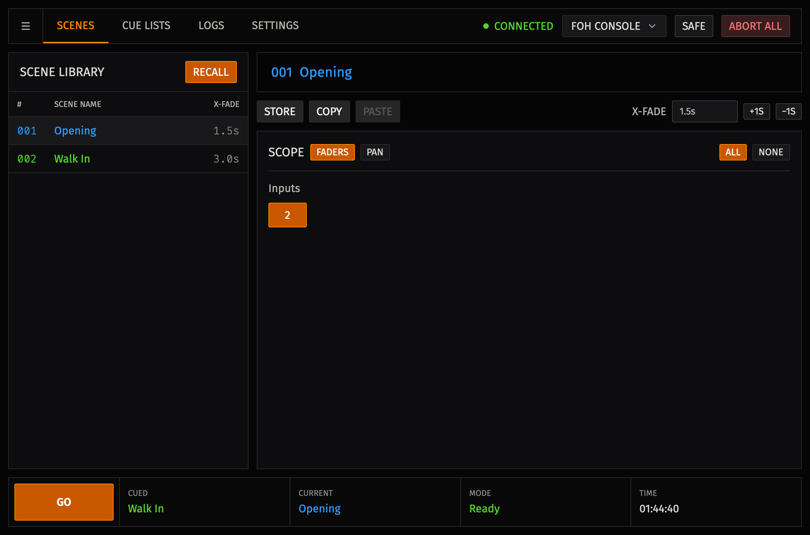
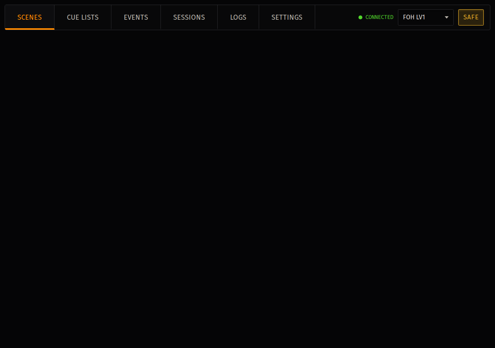

# Application shell

The application shell keeps the controls you need during a show in one place: connection and **SAFE** at the top, the current work screen in the centre, and recall status at the bottom.

## Top bar

Use the tabs to move between **Scenes**, **Cue Lists**, **Logs**, and **Settings**. The **Events** tab is visible in v2, but event automation is not yet available.

The connection indicator shows **Connected**, **Connecting**, or **Offline**. Select the console name to open **Connect to LV1** or change consoles.

If LV1 disconnects, the status changes to **Offline**. Open **Connect to LV1**, select the intended available console, and wait for **Connected** before recalling a scene.

## SAFE

Use **SAFE** when Advanced Show Control must not start a recall.

While **SAFE** is on, **Recall** and **GO** are blocked. LV1 remains available for normal console operation, and a fade that is already running is not stopped.

If you want to use **Mode** to watch a fade finish, wait until the fade is complete before turning on **SAFE**. **Mode** shows **Safe** while SAFE is on, even if controls are still moving.

## Bottom status bar

The bottom bar shows the information you need before **GO**:

| Item | What it shows |
| --- | --- |
| **Cued** | The scene prepared for the next **GO**. |
| **Current** | The scene currently active in LV1. |
| **Mode** | **Offline**, **Ready**, **Safe**, or **Fading**. |
| **Time** | The local time. |

Compare **Cued** and **Current** before pressing **GO**. `---` means no scene is available for that field.

**Ready** means LV1 is connected, **SAFE** is off, and no running fade is displayed. It does not guarantee that **GO** is available; you must also cue a valid entry.

If you move a fader during a fade, **Mode** may return to **Ready** while other controls continue moving. Watch the remaining controls before starting the next transition.

## Sessions

Sessions store scene fades and cue lists in `.ascs` files.

| Command | Shortcut |
| --- | --- |
| **New Session** | `CmdOrCtrl+N` |
| **Open Session...** | `CmdOrCtrl+O` |
| **Save Session** | `CmdOrCtrl+S` |
| **Save As...** | `CmdOrCtrl+Shift+S` |

An asterisk in the window title marks unsaved changes. Version 2 does not ask before you create, open, or close a session with unsaved changes, so save before continuing.
