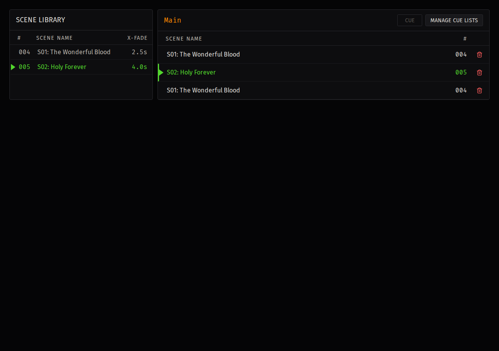
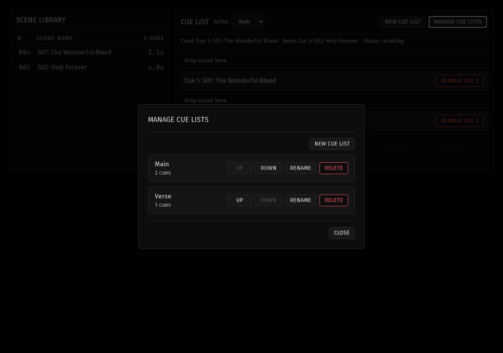
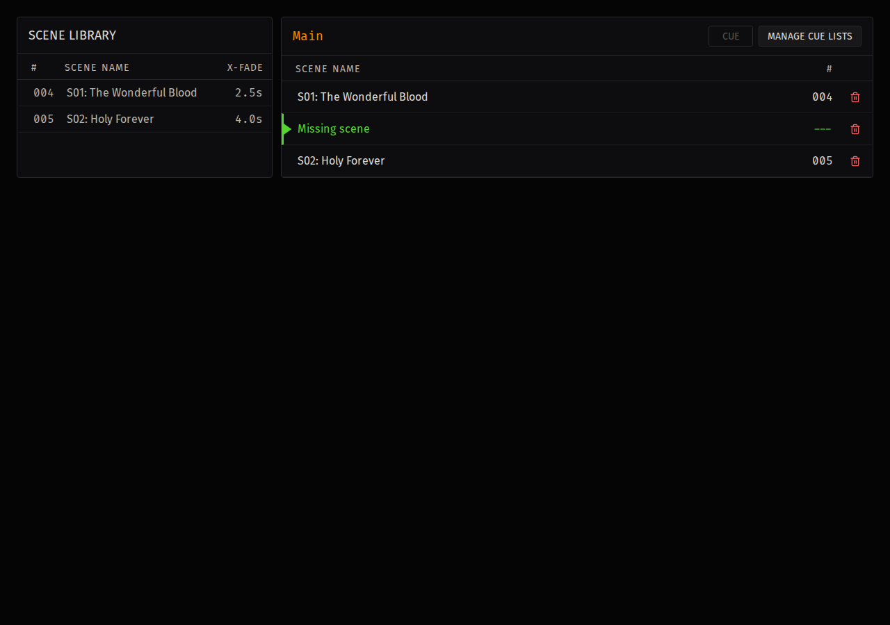

# Cue Lists

The **Cue Lists** screen organizes application-managed scene configurations into an ordered recall sequence. A cue list does not create, rename, or delete LV1 scenes. It stores references to the application's scene configurations and provides the cue selection used by **GO**.

## Screen Overview

The screen has two work areas. The **Scene library** at left contains application-managed scene configurations. The active cue-list pane at right contains the ordered cue entries for the selected list.

Use **Manage Cue Lists** to create and select lists. Drag a scene from the library into the active list to add a cue entry. Drag an existing cue entry to change its order.

## Active Cue List

The active cue-list pane header displays the current list name. It also provides **Cue** and **Manage Cue Lists** controls.

| State | Visible result |
| --- | --- |
| Active list available | The list name and its entries are displayed. |
| No active list | The header displays **No active cue list** and the pane reports **No active cue list.** |
| No selected entry | **Cue** is disabled. |
| Selected entry | **Cue** is enabled until the entry is cued or the selection is no longer valid. |

Selecting a different list clears the local entry selection. Select an entry in the newly active list before preparing another cue.

## Scene Library

The **Scene library** contains the application's scene configurations, not the complete LV1 scene list. A scene must be configured in the application before it can be added to a cue list.

Drag a library row into the active cue-list pane. The insertion preview identifies the position that will receive the new entry. Drop over an existing entry to insert before it, or drop in the remaining pane area to append the entry. The same scene configuration can appear more than once in a cue list.

## Cue Entries

Each cue entry references one application-managed scene configuration. The entry displays the referenced scene name and number. Drag an entry vertically to reorder it. The resulting order is the sequence used when you select and cue entries; reordering does not modify the referenced scene configuration.

Select an entry once to prepare it for **Cue**. Double-click an entry to cue it directly. Select the remove control at the end of an entry row to remove it immediately. Entry removal does not open a confirmation dialog and does not delete the referenced scene configuration or its LV1 scene.

## Selected And Cued States

The list uses row color and direction indicators to distinguish entry state.

| State | Visible indication | Meaning |
| --- | --- | --- |
| Selected | Orange row highlight and indicator | This entry is ready for **Cue**. |
| Cued | Blue text and indicator | This entry supplies the scene shown as **Cued** in the bottom status bar. |
| Current | Green text and indicator | The referenced scene matches the current LV1 scene. |
| Missing scene, not cued | Warning-colored text and indicator; scene number `---` | The cue entry still exists, but its scene configuration is unavailable. |

An entry can be selected before it is cued. Cued state is projected from the active cue list; selecting another entry does not change the current cue until you use **Cue** or double-click that entry.

Cued styling takes precedence over missing-scene styling. A missing entry that is cued uses the blue cued text and indicator shown in the missing-scene screenshot, while **Missing scene** and `---` continue to identify the unavailable reference.

## Manage Cue Lists

Select **Manage Cue Lists** to open the list-management dialog.

| Control | Operation |
| --- | --- |
| List row | Makes that list active and closes the dialog. Selecting the already active list only closes the dialog. |
| **New Cue List** | Opens a name dialog and creates a list when confirmed. |
| Rename control | Opens a name dialog for the selected list. |
| Drag handle | Reorders cue lists. |
| Delete control | Opens **Delete Cue List** confirmation. |

Confirming deletion removes only the app-managed cue list. It does not delete the list's referenced scene configurations or modify LV1 scenes. Review the list name in the confirmation dialog before selecting **Delete**.

## GO

The bottom status bar displays **GO**, **Cued**, **Current**, and the operating mode. **GO** recalls the cued entry from the active cue list. The **Cued** field displays `---` when no valid cued scene is available.

After a successful **GO** recall, the application cues the next entry in the active list. After the last entry recalls successfully, it clears the cue; **Cued** displays `---` and the next **GO** is unavailable until an entry is cued again.

**SAFE** blocks application-initiated recall. Before using **GO**, confirm that **SAFE** is not active, the displayed cued scene is the intended scene, and the console is ready for the recall. **GO** is an application recall request; it does not replace normal LV1 controls.

## Build A Cue List

1. Select the **Cue Lists** tab.
2. Select **Manage Cue Lists**.
3. Select **New Cue List**, enter a name, and confirm creation.
4. Select the required list in the management dialog to make it active.
5. Drag each required scene from the **Scene library** into the active list.
6. Drag cue entries into the required recall order.
7. Use the remove control to remove an entry that is no longer required.

Duplicate entries are permitted. Use separate entries when the same scene configuration is needed at more than one point in the sequence.

## Prepare A Cue

1. Confirm that the intended cue list is active.
2. Select the required entry once.
3. Select **Cue**, or double-click the entry.
4. Confirm that the entry is shown as **Cued** and that the bottom status bar identifies the intended scene.

Selection alone does not prepare a recall. **Cue** assigns the selected entry as the active cue; double-clicking combines selection and cueing.

## Recall With GO

1. Confirm that **SAFE** is not active.
2. Confirm that an active cue list, a cued entry, and the entry's linked scene configuration are available.
3. Verify the **Cued** scene in the bottom status bar against the intended recall.
4. Select **GO** or use the configured GO shortcut.

**SAFE** blocks the application recall request. **GO** is disabled when the active list, cued entry, or linked scene configuration is unavailable. It is also disabled while a recall request is pending. The application blocks duplicate pending requests, so repeated activation cannot send a second request before the first request resolves. If a recall is blocked or rejected, correct the indicated condition before attempting **GO** again.

## Keyboard Operation

The configured CUE shortcut cues the selected entry. The configured GO shortcut recalls the current valid cue. Repeated keydown events are consumed without creating repeated CUE or GO requests.

CUE and GO do not fire while focus is in a dialog text input. This allows list names to be entered without triggering a cue or recall. A GO shortcut matching an unavailable cue is consumed without starting a recall.

## Missing Scenes

Cue lists preserve references to scene configurations that are no longer available. A missing reference remains visible as **Missing scene** with scene number `---`; it is not silently discarded.

Restore or relink the required scene configuration before using that entry for recall. Until the reference resolves, the entry cannot provide a valid cued scene for **GO**.

## Blocked And Disabled States

The following conditions prevent the related action:

| Condition | Result |
| --- | --- |
| No entry is selected | **Cue** is disabled. |
| The selected entry is removed or the active list changes | The local selection is cleared and **Cue** is disabled. |
| No active cue list, cued entry, or linked scene configuration | **GO** is disabled and the cued status displays `---`. |
| A GO request is pending | **GO** is disabled until the request resolves or rejects. |
| **SAFE** is active | The application recall request is blocked. |
| Focus is in a dialog text input | CUE and GO shortcuts do not run. |
| An entry references a missing scene | The entry remains visible, but it cannot supply a valid cue for **GO**. |

## Troubleshooting

- [GO Is Disabled](troubleshooting.md#go-is-disabled)
- [Cue Displays Missing Scene](troubleshooting.md#cue-displays-missing-scene)
