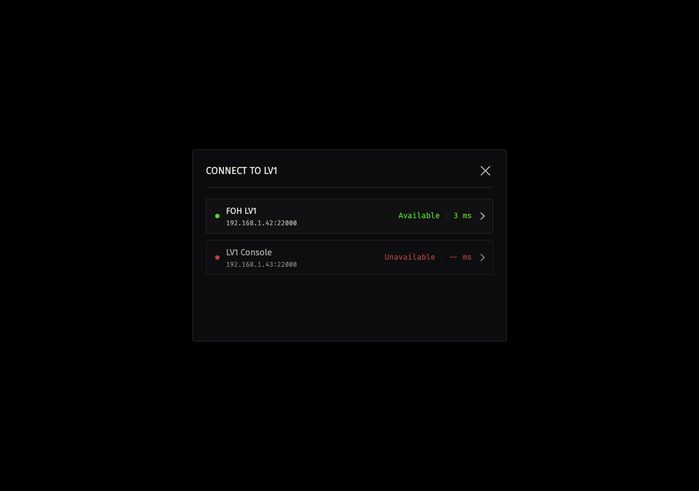

# Getting Started

Use this procedure to install Advanced Show Control, connect to LV1, save a session, configure one scene fade setting, and verify one configured scene transition. You need a reachable Waves eMotion LV1 or LV1 Classic system.

LV1 creates and recalls console scenes. Advanced Show Control stores the scene fade settings linked to those scenes. Rehearse the complete workflow on the intended system before show use.

## Download And Install

1. Download [Advanced Show Control v2 for Windows](https://github.com/mixxorz/advanced-show-control/releases/download/v2/Advanced-Show-Control_v2_Windows_x64_Setup.zip) or [Advanced Show Control v2 for macOS](https://github.com/mixxorz/advanced-show-control/releases/download/v2/Advanced-Show-Control_v2_macOS_universal.dmg).
2. On Windows, extract the ZIP archive and run the installer.
3. On macOS, open the disk image and install the application.
4. Approve the app through the operating system if it is blocked. The v2 downloads are unsigned, and the macOS disk image is not notarized.

## Connect To LV1

**Connect to LV1** opens on first launch and searches for consoles.

1. Wait for the intended console to appear as **Available**.
2. Select its row.
3. Confirm **Connected** and the console name in the top bar.

The dialog also shows address, port, and TCP latency. TCP latency is the time required to reach the console over the network; a lower value means less connection delay. You can select the console when it is **Available**. An **Unavailable** console cannot be selected. When no console is connected, do not recall a scene.

## Create And Save A Session

A session stores scene fade settings and cue lists. It does not replace an LV1 show file.

1. Choose **File > New Session** after connecting to the intended console.
2. Choose **File > Save Session**.
3. Name and save the `.ascs` file.

Save the session after each intended change.

## Configure One Fade

Scope selects which channels and which controls, **FADER** and **PAN**, can move during the fade. Whenever Scope has no channels when you select **Store**, including after **None**, Advanced Show Control restores every current channel to Scope. It preserves the existing **FADER** and **PAN** selections. A new scene fade setting starts with **FADER** on and **PAN** off. Review Scope and remove channels or controls you do not want to move before recall.

1. Open **Scenes** and select the required scene fade setting.
2. Set LV1 to the mix you want the scene to reach.
3. Select **Store** to record the fader and pan values.
4. Select the required channels. Use **All** or **None** when useful.
5. Enable **FADER** and, when needed, **PAN**.
6. Set **X-Fade** from `0.1` through `120` seconds, or enter `0` for a cut.
7. Save the session.

Review scope after every later **Store** as well, especially if the console channel list has changed.

## Recall And Verify

1. Confirm that **SAFE** is off.
2. Compare the displayed LV1 scene number and name with the intended scene.
3. Select **Recall**.
4. Watch the scoped controls reach their stored targets. **Mode** normally changes from **Fading** to **Ready**. If you move a fader, **Mode** can return to **Ready** while other scoped controls continue moving, so observe the controls rather than **Mode** alone.

The fade starts from the fader and pan positions present when you recall the scene. It moves only the controls in scope. If LV1 is offline, the setting is unlinked, or the recalled LV1 scene number and name differ from the selected setting, no fade starts. Correct the condition, confirm the intended scene, and try again.

## Next Steps

- Read [Application Shell](application-shell.md) for connection, SAFE, and status-bar operation.
- Read [Scenes](scenes.md) before you prepare additional scene fade settings.
- Read [Cue Lists](cue-lists.md) before you use **GO** in a show.
