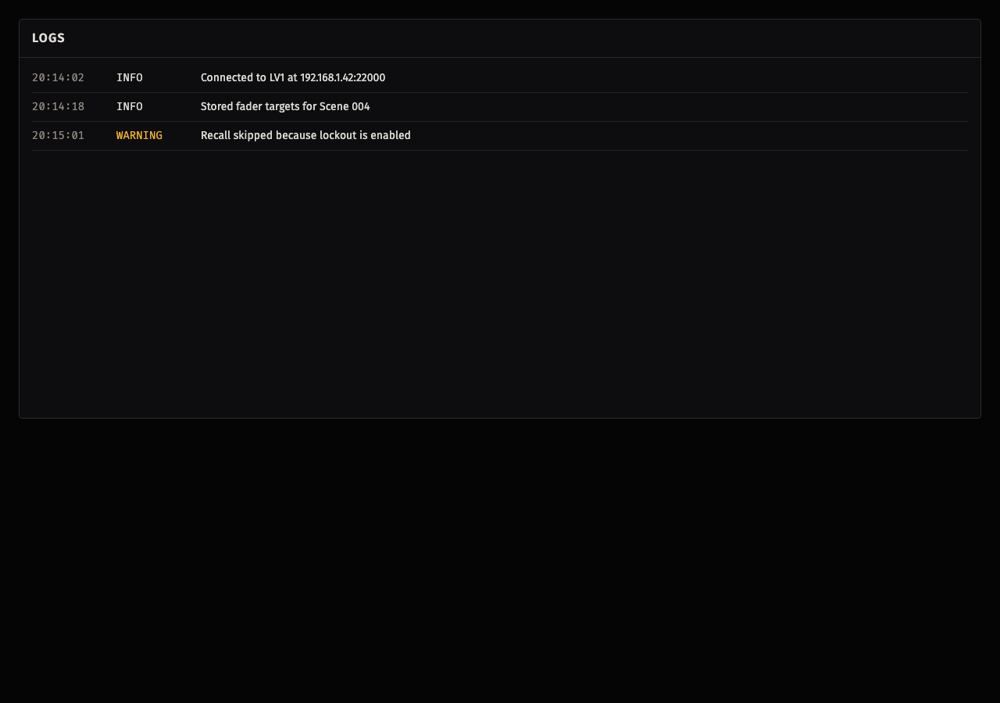

# Logs

The **Logs** screen displays user-visible application events. Use it to review
connection progress, completed operations, warnings, and failures that require
an operator response.



## Log Entries

Each entry contains three fields:

| Field | Meaning |
| --- | --- |
| Timestamp | The time at which the application projected the event into the frontend log. |
| Severity | `INFO`, `WARNING`, or `ERROR`. |
| Message | A complete operator-facing description of the event. |

When no entries are available, the screen reports **No frontend logs yet.**

## Operational And Diagnostic Logs

The Logs screen is an operational view. It receives `INFO`, `WARN`, and
`ERROR` events through the application state projection. Warnings include
visible safety blocks and recoverable failures; errors identify command or
persistence failures that prevent the requested operation.

Diagnostic logs are separate JSONL files for detailed support investigation.
`DEBUG` events are excluded from the visible Logs screen. They may be available
through diagnostic outputs, including the diagnostic JSONL files and application
stdout. Enable **Extensive Diagnostics** in
[Settings](settings.md#general-settings) to retain `DEBUG` events in the
diagnostic file while investigating a problem.

On macOS, normal application diagnostic files are written under:

```text
~/Library/Application Support/com.advancedshowcontrol.app/logs/diagnostics-*.jsonl
```

Each application run creates a timestamped diagnostic file. The Logs screen is
not a complete history of every diagnostic event; use the relevant diagnostic
file when a support request requires low-level detail.

## Reporting A Problem

Include the following in an issue report:

- Application version and operating system version.
- The approximate time of the problem and the steps that reproduce it.
- The connection state, selected scene, and whether **SAFE** was active.
- The relevant Logs-screen entries or a small, relevant diagnostic-file excerpt.

Do not attach full `.ascs` session files or complete diagnostic logs by default.
They can reveal show names, scene names, channel information, and other console
state. Remove sensitive console information before sharing an excerpt, and
provide a complete file only when a trusted support process specifically
requires it.

## Troubleshooting

For an operation with no relevant visible log entry, see [No Visible Log Explains A Failure](troubleshooting.md#no-visible-log-explains-a-failure).
