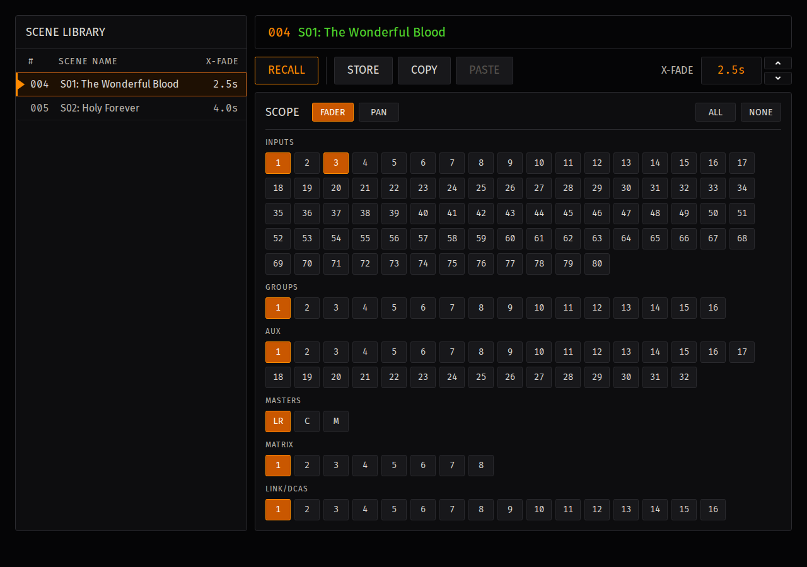
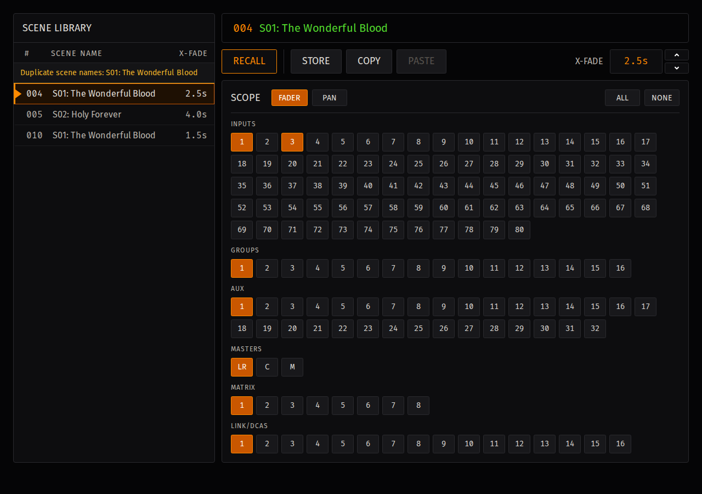
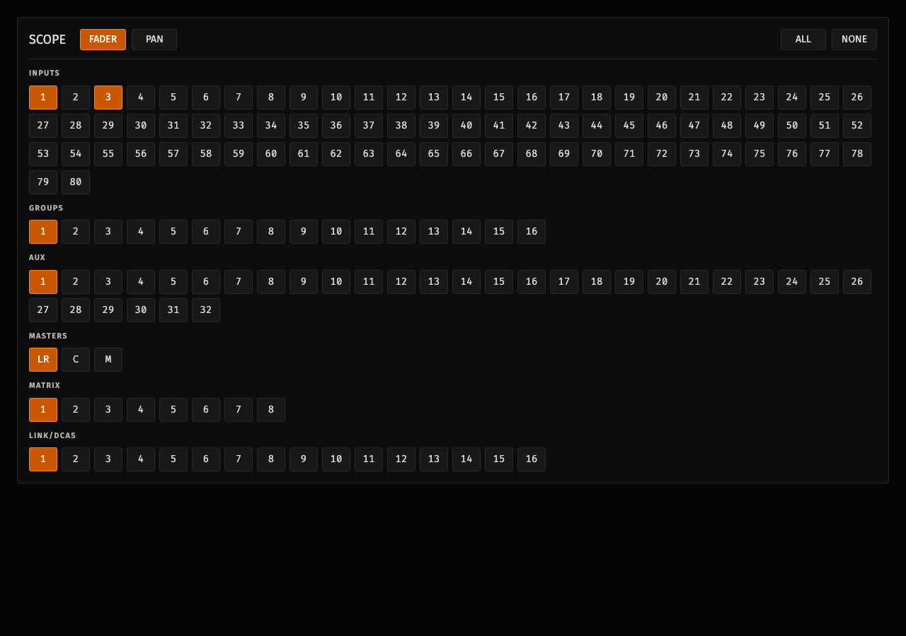
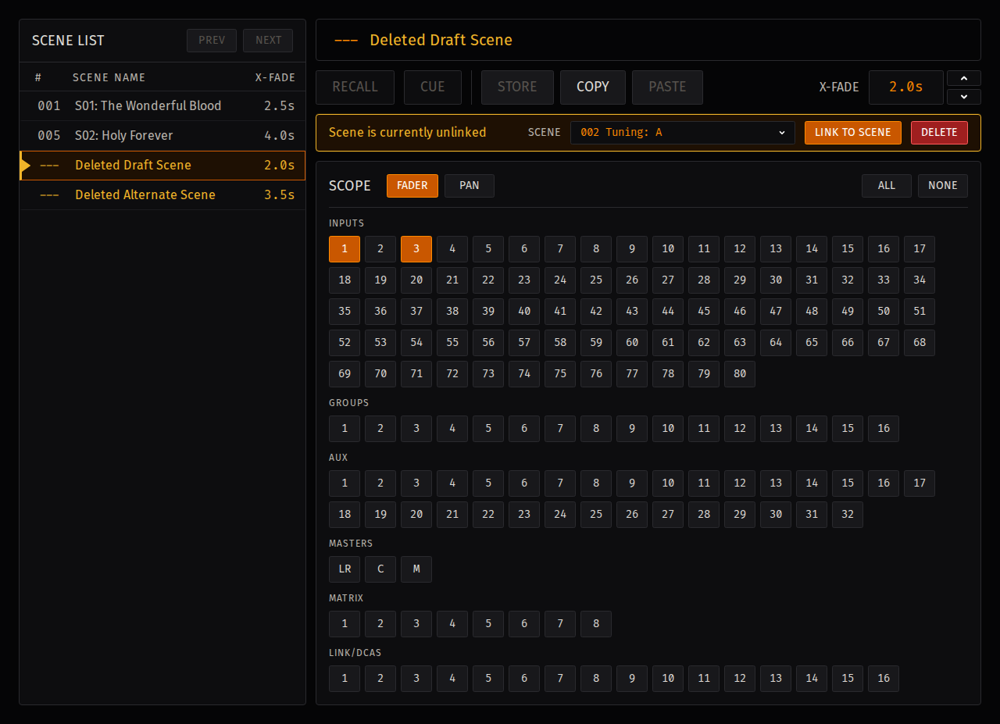

# Scenes

Use **Scenes** to add a fade to an LV1 scene. For each scene, you can store target values, choose the channels and controls that may move, and set the transition time.

## Create a scene fade

1. Select the scene in the **Scene library**.
2. Set LV1 to the mix you want the scene to reach.
3. Choose the channels that may move.
4. Turn on **FADER**. Turn on **PAN** if pan controls should move as well.
5. Select **Store** to capture the current fader and pan values.
6. Set **X-Fade** and save the session.

Scope is the combination of selected channels and enabled controls. Advanced Show Control moves only the faders and pans in scope.

!!! warning "Store with an empty scope"
    A new scene fade has no selected channels, and **FADER** and **PAN** are off. Select the intended channels and enable the controls before you select **Store**. If no channels are in scope when you select **Store**, all current channels are added. **Store** preserves the current **FADER** and **PAN** selections.

## Scene library

The library shows the LV1 scene number, scene name, and **X-Fade** time for each scene fade. Select a row to edit it.

The row indicators identify the selected, current, and cued scenes. An unlinked scene shows `---` instead of an LV1 scene number.

**Duplicate scene names** means more than one scene fade uses the same name. Check the LV1 scene number as well as the name before storing or recalling.

## Store and scope

**Store** captures the current fader and pan values as targets. Storing again replaces those targets with the current LV1 values.

| Control | What it does |
| --- | --- |
| **FADER** | Includes fader targets for the selected channels. |
| **PAN** | Includes available pan-family targets for the selected channels. |
| Channel button | Adds or removes one channel from scope. |
| **All** | Adds every available channel. |
| **None** | Removes every channel. |

Every new scene fade starts with an empty scope: no channels are selected, and **FADER** and **PAN** are off. Select the intended channels and enable the controls before you store or recall the fade.

If both **FADER** and **PAN** are off, LV1 can still recall the scene, but Advanced Show Control will not move any controls.

## Fade time

Set **X-Fade** to `0` for an immediate cut or from `0.1` to `120` seconds for a timed transition. Press `Enter` or move away from the field to apply the value. You can include a trailing `s`.

Invalid, empty, or negative values return to the previous setting.

## Recall a scene

1. Confirm that LV1 is **Connected** and **SAFE** is off.
2. Select the scene fade.
3. Check its LV1 scene number and name.
4. Select **Recall**.

LV1 recalls the scene first. When the recalled number and name match, Advanced Show Control moves the controls in scope from their current positions to the stored targets.

If the number or name does not match, the fade does not start. Correct the scene link or select the intended scene, then try again.

Moving a fader during a fade gives you control of that fader; the other scoped controls may continue moving. If LV1 disconnects, the fade stops. Reconnect and confirm the console state before recalling again.

## Link a missing scene

When an LV1 scene can no longer be found, its scene fade becomes unlinked. Its fade time and scope are retained, but **Store** and **Recall** are unavailable.

1. Select the unlinked scene fade.
2. Choose the intended scene from **LV1 Scene**.
3. Select **Link to scene**.
4. Confirm the scene number and name.

If **Overwrite Existing Fade Settings?** appears, continue only when you intend to replace the fade already linked to that LV1 scene.

**Delete** removes the scene fade from Advanced Show Control. It does not delete the scene in LV1.

## Copy and paste scene settings

Use **Copy** to retain the settings from the selected scene fade for a later paste. **Copy** retains the **X-Fade** time, **FADER** and **PAN** selections, stored channel target data, and selected channel scope. It does not change the source scene fade.

You can copy settings from a linked or unlinked scene fade. **Paste** is available only when copied settings are present and the destination scene fade is linked to an LV1 scene.

1. Select the scene fade whose settings you want to copy.
2. Select **Copy**.
3. Select the linked destination scene fade.
4. Select **Paste**.

**Paste** replaces the destination fade's copied settings but retains the destination's LV1 scene number and name. It does not change the source scene fade. If the destination already has identical settings, **Paste** makes no change and does not mark the session as changed.

The copied settings are available only for the current session. Creating, opening, or replacing a session clears the copied settings. Copy the settings again after changing sessions.

## Troubleshooting

- [Scene Is Unlinked](troubleshooting.md#scene-is-unlinked)
- [Recall Is Disabled Or Does Not Fade](troubleshooting.md#recall-is-disabled-or-does-not-fade)
