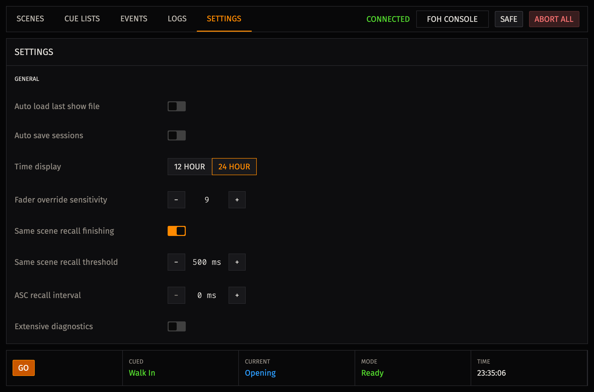

# Settings

The **Settings** screen stores application preferences. Settings changes are
saved as a complete replacement of the current settings object. If a save
fails, the screen reports the error and restores the projected settings.

## General Settings

| Setting | Current behavior |
| --- | --- |
| **Auto load last show file** | Displayed and stored. It is not currently wired to open a session at startup. |
| **Auto save sessions** | Displayed and stored. It is not currently wired to save a session after changes. Use **File > Save Session** to save intentional work. |
| **Time display** | Valid values are **12 hour** and **24 hour**. The selected value is displayed and stored. It is not currently wired to change the clock shown in the application. |
| **Fader override sensitivity** | Select a value from 1 through 10. The control is displayed and stored, but the current fade engine does not consume this setting. |
| **Extensive diagnostics** | When enabled, diagnostic files include `DEBUG` events. When disabled, diagnostic files include `INFO`, `WARN`, and `ERROR` events. Enable it only while troubleshooting because diagnostic files can grow quickly. |

The Fader override sensitivity help text describes the intended scale: 10
reacts to very small fader movements, while 1 requires a larger movement. The
current runtime always uses its existing manual-override behavior; changing
this stored setting does not change that behavior.

## Keyboard Shortcuts

**GO** and **CUE** are configurable action shortcuts. Their defaults are
`Space` for GO and `C` for CUE. GO recalls the current valid cue; CUE prepares
the selected cue-list entry. See [Cue Lists](cue-lists.md#keyboard-operation)
for the conditions that allow those actions.

To change either shortcut:

1. Select its shortcut control. The control displays `...` while it captures a key.
2. Press the required key combination.
3. Confirm that the control displays the new combination.

Capture records a non-modifier key together with any Shift, Control, Alt, or
Meta modifier held at the time. Press `Escape` to cancel without changing the
shortcut. Pressing only a modifier keeps capture active. `Tab` is a valid
captured shortcut; while capture is active it does not move focus.

The application compares shortcut keys without regard to letter case. It
rejects a shortcut that is already assigned to the other configurable action.
It also rejects conflicts with the fixed file commands listed in
[Keyboard Shortcuts](reference/keyboard-shortcuts.md#fixed-file-shortcuts).

Action shortcuts do not run while focus is in a text input, text area, select
control, editable content, or dialog. Repeated keydown events do not create
repeated CUE or GO requests.

## Settings And Safety

Settings do not override application safety checks. In particular, changing a
shortcut does not make an unavailable cue valid, and it does not bypass
**SAFE**, LV1 connection requirements, or scene identity validation. Review
the displayed cue and console state before using GO.

## Troubleshooting

For settings that are displayed and stored but do not change application behavior, see [A Setting Does Not Change Application Behavior](troubleshooting.md#a-setting-does-not-change-application-behavior).
